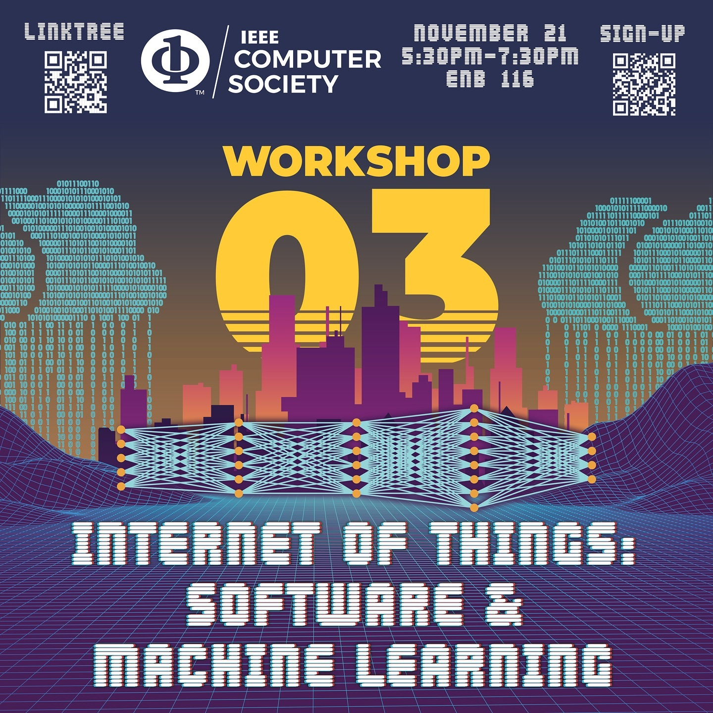

# IoT Workshop 3: Software and Machine Learning

The third session in the 2023 IoT workshop series from the IEEE Computer Society student branch chapter at the University of South Florida. The first two covered the concepts and the hardware. This one put a trained model on the board.

Tuesday, November 21, 2023, 5:30 to 7:30 PM, ENB 116.

## What we covered

- What a model is, which tools train one, and where that fits in an IoT system.
- Reading temperature data out of a CSV, then training and testing on it.
- Converting a TensorFlow model to a `.h` header and flashing it to an Argon board.

That last step is the interesting one. A model becomes a C array you compile into firmware, because the board has no Python and no room for a runtime.

## Files

- `iot-ml.pdf`, the slides.
- `src/`, a TensorFlow Lite for Microcontrollers hello world ported to Particle. `sine_model_data.cpp` is the trained model as a byte array, and `particle_main.cpp` runs inference on the board.

## Links

- [Announcement on Instagram](https://www.instagram.com/p/Cz1pzALRoRt/)
